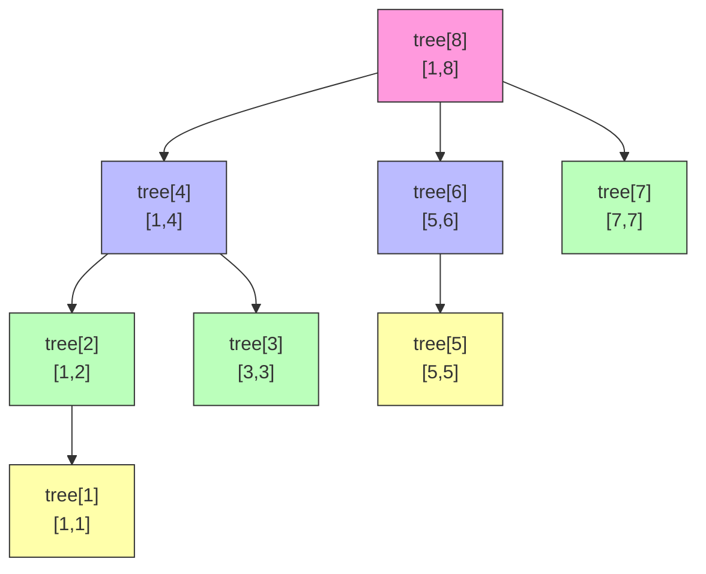

# 算法模板

## 树状数组 (BIT / Fenwick Tree)

```python
class BIT:
    __slots__ = "tree"

    def __init__(self, n: int):
        self.tree = [0] * (n + 1)  # 下标从 1 开始, 0 不用

    def update(self, i: int, v: int) -> None:
        while i < len(self.tree):
            self.tree[i] += v      # 或 max
            i += i & -i            # 加 lowbit, 往上更新

    def pre(self, i: int) -> int:
        res = 0
        while i > 0:
            res += self.tree[i]    # 或 max
            i -= i & -i            # 减 lowbit, 往下查询
        return res
```

每个 `tree[i]` 管辖区间长度 = `i & -i`(lowbit):
```
tree[1] (001) → [1,1]   tree[5] (101) → [5,5]
tree[2] (010) → [1,2]   tree[6] (110) → [5,6]
tree[3] (011) → [3,3]   tree[7] (111) → [7,7]
tree[4] (100) → [1,4]   tree[8](1000) → [1,8]
```

配合**离散化**使用: `sorted(set(nums))` 将值压缩到连续整数, 用 `bisect_left` 映射下标。

**适用场景**: 需要频繁做单点更新 + 前缀查询(求和或求最大值), 如逆序对、区间求和、动态前缀最大值、LIS 优化。

**注意**: 树状数组只能做前缀查询, 不能做任意区间最大值查询。前缀求和可以用差值算区间 `sum(l,r) = pre(r) - pre(l-1)`, 但前缀最大值不行 `max(l,r) ≠ pre(r) - pre(l-1)`。需要任意区间最大值时必须用线段树。

### 原理

核心思想: 利用二进制 lowbit (`i & -i`) 把数组拆分成不同大小的区间。

每个 `tree[i]` 管辖 `lowbit(i)` 个元素, 即区间 `[i - lowbit(i) + 1, i]`。

**结构图** (n=8):



**查询 pre(7)**: 减 lowbit 跳到前一个不重叠区间
```
7(111) → tree[7]=[7,7]
6(110) → tree[6]=[5,6]  (7 - lowbit(7) = 6)
4(100) → tree[4]=[1,4]  (6 - lowbit(6) = 4)
0      → 停止            (4 - lowbit(4) = 0)
结果 = tree[7] + tree[6] + tree[4] = [1,7] ✅
```

**更新 update(3)**: 加 lowbit 往上传播到所有包含该位置的节点
```
3(011) → tree[3]=[3,3]  ✅
4(100) → tree[4]=[1,4]  ✅ (3 + lowbit(3) = 4)
8(1000)→ tree[8]=[1,8]  ✅ (4 + lowbit(4) = 8)
```

**本质**: `pre(i)` = 把 i 的二进制中每个 1 对应的 tree 节点值加起来。i 有几个 1 就访问几个节点, 所以最多 log(n) 次。
```
pre(7) = pre(111) = tree[111] + tree[110] + tree[100]  → 3个1, 3个节点
pre(6) = pre(110) = tree[110] + tree[100]              → 2个1, 2个节点
```

## 线段树 (Segment Tree)

用数组存储完全二叉树, 支持**单点更新 + 区间查询**, 均为 O(log n)。

```python
class SegmentTree:
    __slots__ = ["length", "tree"]

    def __init__(self, n: int):
        self.length = n
        # 数组大小 = 2 * next_pow2(n)
        # 叶子数向上对齐到 2 的幂再乘 2
        self.tree = [0] * (2 << n.bit_length())

    def query_all(self) -> int:
        return self.tree[1]  # 根节点 = 整个区间的结果

    def query(self, start: int, end: int) -> int:
        return self._query(1, 0, self.length - 1, start, end)

    def update(self, index: int, val: int) -> None:
        self._update(1, 0, self.length - 1, index, val)

    def _update(self, node, left, right, index, val):
        if left == right:
            self.tree[node] = val
            return
        mid = (left + right) // 2
        if index <= mid:
            self._update(node * 2, left, mid, index, val)
        else:
            self._update(node * 2 + 1, mid + 1, right, index, val)
        self.tree[node] = self._merge(self.tree[node * 2], self.tree[node * 2 + 1])

    def _query(self, node, left, right, start, end):
        if left >= start and right <= end:
            return self.tree[node]
        mid = (left + right) // 2
        if end <= mid:
            return self._query(node * 2, left, mid, start, end)
        if start > mid:
            return self._query(node * 2 + 1, mid + 1, right, start, end)
        return self._merge(
            self._query(node * 2, left, mid, start, end),
            self._query(node * 2 + 1, mid + 1, right, start, end),
        )

    def _merge(self, v1, v2):
        return max(v1, v2)  # 改成 + 就变成区间求和
```

下标从 1 开始: node 的左子 = `node*2`, 右子 = `node*2+1`。

**树状数组 vs 线段树:**

| | 树状数组 (BIT) | 线段树 |
|---|---|---|
| 查询类型 | 前缀查询 | 任意区间查询 |
| 代码量 | 少 | 多 |
| 常数 | 小 | 大 |
| 适用 | 前缀和/前缀最大值 | 任意区间操作 |

**选择原则**: 能用树状数组就用树状数组(代码短, 常数小); 需要任意区间最大/最小值或区间修改时才用线段树。

**应用场景:**

| 场景 | 用 BIT | 用线段树 |
|------|--------|----------|
| 前缀求和 / 区间求和 | ✅ | ✅ |
| 前缀最大值 | ✅ | ✅ |
| 任意区间最大/最小值 | ❌ | ✅ |
| LIS 优化 (值域前缀最大值) | ✅ | ✅ |
| 逆序对计数 | ✅ | ✅ |
| 动态排名 / 第 k 小 | ✅ | ✅ |
| 带约束的区间查询 (如 [val-k, val-1]) | ❌ | ✅ |
| 区间修改 + 区间查询 (懒标记) | ❌ | ✅ |

## 单调队列 (Monotonic Deque)

维护滑动窗口的最大值/最小值, O(1) 更新。

```python
from collections import deque

# 模板: 找最长子数组使得 max - min <= k
max_q, min_q = deque(), deque()  # 单调递减/递增队列
left, res = 0, 0
for i in range(n):
    # 维护单调递减队列 (max): 弹出尾部比当前小的
    while max_q and nums[max_q[-1]] <= nums[i]:
        max_q.pop()
    max_q.append(i)
    # 维护单调递增队列 (min): 弹出尾部比当前大的
    while min_q and nums[min_q[-1]] >= nums[i]:
        min_q.pop()
    min_q.append(i)
    # 收缩左边界直到 max - min <= k
    while nums[max_q[0]] - nums[min_q[0]] > k:
        left += 1
        if max_q[0] < left:
            max_q.popleft()
        if min_q[0] < left:
            min_q.popleft()
    res = max(res, i - left + 1)  # 最长窗口
```

队列存**下标**, 队头 = 窗口最大/最小值。新元素从尾部进入, 弹出比它小(或大)的, 保持单调性。窗口收缩时从头部弹出过期元素。

**适用场景**: 滑动窗口最大/最小值、DP 前缀和优化 (如 p3578)。
相关题: p0239 (滑动窗口最大值), p1438 (最长连续子数组绝对差 <= k)。

## 预处理回文代价矩阵

预计算 `cost[i][j]` = 把 `s[i..j]` 变成回文的最小替换次数, O(n^2) 时间和空间。

```python
n = len(s)
cost = [[0] * n for _ in range(n)]
for length in range(2, n + 1):       # 按区间长度从小到大填
    for i in range(n - length + 1):
        j = i + length - 1
        cost[i][j] = cost[i + 1][j - 1] + (s[i] != s[j])
```

依赖关系: `cost[i][j]` 依赖左下方 `cost[i+1][j-1]` (更短的区间, 已算好)。

```
       j=0  j=1  j=2  j=3
i=0  [  0    ①    ②    ③  ]     填表顺序:
i=1  [       0    ①    ②  ]       对角线 = 0 (长度 1)
i=2  [            0    ①  ]       ① 长度 2, ② 长度 3, ③ 长度 4
i=3  [                 0  ]
```

**适用场景**: 区间划分 DP 中需要反复查询子串回文代价时, 用 O(1) 查表替代 O(n) 双指针, 将总复杂度从 O(k*n^3) 降到 O(k*n^2)。
相关题: p1278 (Palindrome Partitioning III)。

## 预处理回文判定矩阵

预计算 `is_palin[i][j]` = `s[i..j]` 是否是回文, O(n^2) 时间和空间。

```python
n = len(s)
is_palin = [[False] * n for _ in range(n)]
for i in range(n - 1, -1, -1):       # 从后往前填
    for j in range(i, n):
        is_palin[i][j] = s[i] == s[j] and (j - i <= 2 or is_palin[i + 1][j - 1])
```

递推条件: `s[i] == s[j]` 且内部 `s[i+1..j-1]` 也是回文。`j - i <= 2` 处理长度 1~3 的 base case (去掉两端后为空或单字符, 天然回文)。

依赖关系: `is_palin[i][j]` 依赖 `is_palin[i+1][j-1]` (下一行, 左一列), 所以 i 从大到小填。

```
以 s = "abba" 为例:

         j=0   j=1   j=2   j=3
i=0  [   T     F     F     T   ]     填表顺序: i 从下往上
i=1  [         T     T     F   ]       i=3 → i=2 → i=1 → i=0
i=2  [               T     F   ]     每行 j 从 i 到 n-1
i=3  [                     T   ]

is_palin[0][3] = (s[0]=='a' == s[3]=='a') and is_palin[1][2]
               = True and True = True  → "abba" 是回文 ✅
is_palin[1][2] = (s[1]=='b' == s[2]=='b') and (j-i <= 2)
               = True and True = True  → "bb" 是回文 ✅
```

**与回文代价矩阵的区别:**
- `is_palin[i][j]`: 布尔值, 判断是否回文 → 用于回文划分 (p0132)
- `cost[i][j]`: 整数, 最少替换几个字符变成回文 → 用于回文划分最小修改 (p1278)
- 两者依赖方向相同, 都依赖 `[i+1][j-1]`

**适用场景**: 回文划分 DP 中需要 O(1) 判断子串是否回文。
相关题: p0131 (Palindrome Partitioning), p0132 (Palindrome Partitioning II), p2472。

## 区间划分 DP: 二分 vs DP

区间划分问题的优化目标决定了能否用二分答案:

| 优化目标 | 方法 | 复杂度 | 例题 |
|----------|------|--------|------|
| minimize(**max** of segment values) | 二分答案 + 贪心 | O(n * log V) | p0410 |
| minimize(**sum** of segment values) | DP | O(k * n^2) | p1335 |

**minimax → 二分**: 二分答案 mid, 贪心验证"每段代价 <= mid 能否分成 <= k 段"。段数 <= k 也合法, 因为多余的段可以继续拆分, 代价不会增大。

**min-sum → DP**: 无法贪心验证"总代价 <= X?", 因为某段多分一个元素虽不增加本段代价, 但可能影响后续段的最优分配, 存在全局耦合。

## 状态机 DP vs 子序列选取 DP

两类 DP 结构相似但决策模型不同, 关键看"跳过"是否存在:

| | 状态机 DP | 子序列选取 DP |
|---|---|---|
| 每步决策 | 必须选一个状态 | 选或不选 |
| 跳过 | 不能跳过, 每步都处于某个状态 | 可以跳过, 只访问子序列 |
| 状态含义 | "第 i 步处于状态 j" | "前 i 个中选了若干个, 最后选的是 j" |
| 例题 | p0122, p0188, p0309, p0714 (股票) | p2222, p2786 (子序列选取) |

**判断方法**: 如果每个位置都必须参与决策 (不能跳过), 就是状态机; 如果可以跳过某些位置, 就是子序列选取。

例: 股票买卖中第 3 天不交易, 但仍处于"持股/不持股"状态, 不存在"跳过第 3 天"; 而 p2786 可以完全不访问某个位置, 对后续无影响。

## 字典树 (Trie)

```python
class TrieNode:
    __slots__ = ("children", "is_end")

    def __init__(self):
        self.children = [None] * 26  # 26 个字母, None 表示无子节点
        self.is_end = False

class Trie:
    def __init__(self):
        self.root = TrieNode()

    def insert(self, word: str) -> None:
        node = self.root
        for c in word:
            i = ord(c) - ord('a')
            if not node.children[i]:
                node.children[i] = TrieNode()  # 按需创建
            node = node.children[i]
        node.is_end = True

    def search(self, word: str) -> bool:
        node = self.root
        for c in word:
            i = ord(c) - ord('a')
            if not node.children[i]:
                return False
            node = node.children[i]
        return node.is_end
```

**注意 children 初始化:**
```python
[None] * 26          # ✅ 先放 None, 需要时再创建实例
[TrieNode()] * 26    # ❌ 26 个位置指向同一个实例
[TrieNode() for _ in range(26)]  # ❌ 语法正确但会无限递归(每个子节点又创建26个)
```
